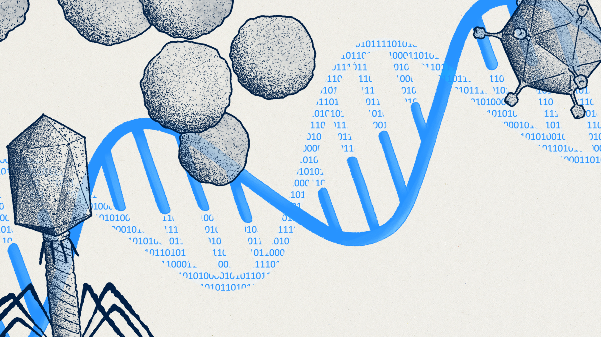

# Evo: DNA foundation modeling from molecular to genome scale



Evo is a biological foundation model capable of long-context modeling and design.
Evo uses the [StripedHyena architecture](https://github.com/togethercomputer/stripedhyena) to enable modeling of sequences at a single-nucleotide, byte-level resolution with near-linear scaling of compute and memory relative to context length.
Evo has 7 billion parameters and is trained on OpenGenome, a prokaryotic whole-genome dataset containing ~300 billion tokens.

We describe Evo in the the paper [“Sequence modeling and design from molecular to genome scale with Evo”](https://arcinstitute.org/manuscripts/Evo) and in the [accompanying blog post]().

We provide the following model checkpoints:
| Checkpoint Name                        | Description |
|----------------------------------------|-------------|
| `evo-1-pretrained-8k`     | A model pretrained with 8,192 context. We use this model as the base model for molecular-scale finetuning tasks. |
| `evo-1-pretrained-131k`   | A model pretrained with 131,072 context using `evo-1-pretrained-8k` as the base model. We use this model to reason about and generate sequences at the genome scale. |

## Contents

- [Setup](#setup)
  - [Requirements](#requirements)
  - [Installation](#installation)
- [Usage](#usage)
- [HuggingFace](#huggingface)
- [Together API](#together-api)
- [Citation](#citation)

## Setup

### Requirements

Evo uses [FlashAttention-2](https://github.com/Dao-AILab/flash-attention), which may not work on all GPU architectures.
Please consult the [FlashAttention GitHub repository](https://github.com/Dao-AILab/flash-attention#installation-and-features) for the current list of supported GPUs.

Evo also uses PyTorch. Make sure the correct [PyTorch version is installed](https://pytorch.org/) on your system.

### Installation

You can install Evo using `pip`
```bash
pip install evo-model
```
or directly from the GitHub source
```bash
git clone https://github.com/evo-design/evo.git
cd evo/
pip install .
```

We recommend that you install the PyTorch library first, before installing all other dependencies (due to dependency issues of the `flash-attn` library; see, e.g., this [issue](https://github.com/Dao-AILab/flash-attention/issues/246)).


## Usage

Below is an example of how to download Evo and use it locally through the Python API.
```python
from evo import Evo
import torch

device = 'cuda:0'

evo_model = Evo('evo-1-pretrained-131k')
model, tokenizer = evo_model.model, evo_model.tokenizer
model.to(device)
model.eval()

sequence = 'ACGT'
input_ids = torch.tensor(
    tokenizer.tokenize(sequence),
    dtype=torch.int,
).to(device).unsqueeze(0)
logits, _ = model(input_ids) # (batch, length, vocab)

print('Logits: ', logits)
print('Shape (batch, length, vocab): ', logits.shape)
```
An example of batched inference can be found in [`scripts/example_inference.py`](scripts/example_inference.py).

We provide an [example script](scripts/generate.py) for how to prompt the model and sample a set of sequences given the prompt.
```bash
python -m scripts.generate \
    --model-name 'evo-1-pretrained-131k' \
    --prompt ACGT \
    --n-samples 10 \
    --n-tokens 100 \
    --temperature 1. \
    --top-k 4 \
    --device cuda:0
```

We also provide an [example script](scripts/generate.py) for using the model to score the log-likelihoods of a set of sequences.
```bash
python -m scripts.score \
    --input-fasta examples/example_seqs.fasta \
    --output-tsv scores.tsv \
    --model-name 'evo-1-pretrained-131k' \
    --device cuda:0
```

## HuggingFace

Evo is integrated with [HuggingFace](https://huggingface.co/togethercomputer/evo-1-131k-base).
```python
from transformers import AutoConfig, AutoModelForCausalLM

model_name = 'togethercomputer/evo-1-8k-base'

model_config = AutoConfig.from_pretrained(model_name, trust_remote_code=True)
model_config.use_cache = True

model = AutoModelForCausalLM.from_pretrained(
    model_name,
    config=model_config,
    trust_remote_code=True,
)
```


## Together API

Evo is also available via an API by [TogetherAI](https://www.together.ai/).

```python
import openai
import os

# Fill in your API information here.
client = openai.OpenAI(
  api_key=TOGETHER_API_KEY,
  base_url='https://api.together.xyz',
)

chat_completion = client.chat.completions.create(
  messages=[
    {
      "role": "system",
      "content": ""
    },
    {
      "role": "user",
      "content": "ACGT", # Prompt the model with a sequence.
    }
  ],
  model="togethercomputer/evo-1-131k-base",
  max_tokens=128, # Sample some number of new tokens.
  logprobs=True
)
print(
    chat_completion.choices[0].logprobs.token_logprobs,
    chat_completion.choices[0].message.content
)
```

## Citation

Please cite the following preprint when referencing Evo.

```
@article{nguyen2024sequence,
   author = {Eric Nguyen and Michael Poli and Matthew G. Durrant and Armin W. Thomas and Brian Kang and Jeremy Sullivan and Madelena Y. Ng and Ashley Lewis and Aman Patel and Aaron Lou and Stefano Ermon and Stephen A. Baccus and Tina Hernandez-Boussard and Christopher Ré and Patrick D. Hsu and Brian L. Hie},
   journal = {Arc Institute manuscripts},
   title = {Sequence modeling and design from molecular to genome scale with Evo},
   url = {https://arcinstitute.org/manuscripts/Evo},
   year = {2024},
}
```